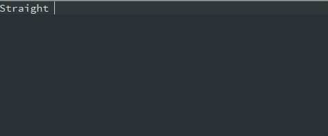

# PYAUTOKEY

Small project to replace the functions I commonly use Autohotkey for. Incorporating a plugin system for loading and running python modules on the fly, opening up massive flexibility via Python without the baggage of Autohotkey scripting syntax (no shade, I've used it for years).



---
# CURRENT FEATURES

- Static text replacement.
- System tray icon. Right click and choose Quit to exit.
- Hotkeys. Trigger a Python function on hotkey press like `ctrl+shift+u`

## CONFIGURATION FILE
JSON configuration file `pyautokey.json` in the current directory or `%APPDATA%\pyautokey`. File should be UTF-8 encoded. Contents as follows:

The application implements a plugin architecture by placing python modules in a `plugins` directory. Plugin modules should implement a `@dataclass` which has an `invoke()` method and the module should contain a `register()` method which calls `factory.register("module_name", class_name)`. See the included examples for more information.

### SECTION `config`
|Key|Value|
|--|--|
|`macro_start`|Character that will start looking for a text expansion. I use `:`
|`macro_end`|Character that will trigger text expansion. I use space. This is defined in the config here as "Key.space" which translates directly to `pynput` hotkey parsing.
|`segment_delay`|Delay in ms between segments of an expansion. Default is 0. e.g. if set to 500 is equivalent to "sometext<delay 500><enter><delay 500>some more text"
|`plugins`|Defines names of plugin classes to load from the `plugins` directory. Values should be `plugins.` followed by the name of the Python file with no extension|
|`actions`|Defines actions which will be executed by plugins. See below for action specification|

#### ACTION SPECIFICATION
Actions are described key/value pairs as follows:
|Key|Value|
|--|--|
|`type`|The type of plugin that will execute this action|
|`trigger`|When the action is invoked. Currently `replacement` for use during text expansion or `hotkey` for hotkeys.|
|`shortmatch`|Used to determine when the trigger applies. Either the text that will act as the signal to call the plugin, obtain the text and use it for expansion, or the hotkey to wait on that will invoke the plugin|
|`async`|The invoke function for this plugin will be called once from the main function of the application and is expected to return immediately. Use for asynchronous processing done on its own thread. See `plug_uatu.py` for an example that keeps watch for a file every 10s and deletes it if present|

##### PLUGIN DEPENDENCIES
The current build script adds libraries used by the current set of plugins. Need to find a better solution than baking these in at build time.

### SECTION `replacements`
Multiple key, value entries of text to watch for and text it will be replaced with. Special characters that `pynput` recognises are surrounded by `<` `>` so `<enter>` for the enter key. Special expansions are as follows:
|Expansion|Result|
|--|--|
|`<delay nnn>`|Pause for `nnn` ms before continuing.|
|`<custom>`|Triggers a text expansion plugin if it is a match for the plugins `shortmatch` value of `<custom>`.|

---
# BUILD
```powershell
./build.ps1
```
## OPTIONAL

Build Wheels for machines without C compiler:
```powershell
pip wheel -r ./requirements.txt -w "./wheels"
```
and deploy with
```powershell
pip install --no-index --find-links .\wheels -r .\requirements.txt
```

---
# REFERENCES
* [The Power Of The Plugin Architecture In Python](https://www.youtube.com/watch?v=iCE1bDoit9Q)

# HOTKEYS
List of hotkeys `pynput` understands
```python
hotkeys = ['\t', '\n', '\r', 
           'accept', 'add', 'alt', 'altleft', 'altright', 'apps', 'backspace',
           'browserback', 'browserfavorites', 'browserforward', 'browserhome',
           'browserrefresh', 'browsersearch', 'browserstop', 'capslock', 'clear',
           'convert', 'ctrl', 'ctrlleft', 'ctrlright', 'decimal', 'del', 'delete',
           'divide', 'down', 'end', 'enter', 'esc', 'escape', 'execute', 'f1', 'f10',
           'f11', 'f12', 'f13', 'f14', 'f15', 'f16', 'f17', 'f18', 'f19', 'f2', 'f20',
           'f21', 'f22', 'f23', 'f24', 'f3', 'f4', 'f5', 'f6', 'f7', 'f8', 'f9',
           'final', 'fn', 'hanguel', 'hangul', 'hanja', 'help', 'home', 'insert', 'junja',
           'kana', 'kanji', 'launchapp1', 'launchapp2', 'launchmail',
           'launchmediaselect', 'left', 'modechange', 'multiply', 'nexttrack',
           'nonconvert', 'num0', 'num1', 'num2', 'num3', 'num4', 'num5', 'num6',
           'num7', 'num8', 'num9', 'numlock', 'pagedown', 'pageup', 'pause', 'pgdn',
           'pgup', 'playpause', 'prevtrack', 'print', 'printscreen', 'prntscrn',
           'prtsc', 'prtscr', 'return', 'right', 'scrolllock', 'select', 'separator',
           'shift', 'shiftleft', 'shiftright', 'sleep', 'space', 'stop', 'subtract', 'tab',
           'up', 'volumedown', 'volumemute', 'volumeup', 'win', 'winleft', 'winright', 'yen',
           'command', 'option', 'optionleft', 'optionright']
```